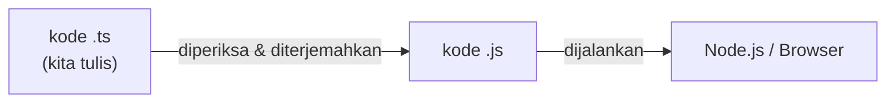

# 01 · Hello TypeScript

## 🎯 Tujuan Belajar
- Memahami apa itu **program** dan **kode**
- Mengenal **TypeScript** dan alasan memakainya
- Menampilkan teks ke layar dengan `console.log`
- Menulis **komentar** di kode

---

## 🧠 Analogi: Program = Resep Masakan

Program adalah **daftar perintah** yang dijalankan komputer satu per satu dari **atas ke bawah**, seperti resep masakan:

1. Panaskan wajan
2. Masukkan minyak
3. Goreng telur

Komputer sangat patuh tapi tidak bisa menebak maksud kita. Perintahnya harus ditulis dengan tepat.

---

## 📘 Apa itu JavaScript dan TypeScript?

| | JavaScript (JS) | TypeScript (TS) |
| :--- | :--- | :--- |
| Apa itu? | Bahasa pemrograman untuk web dan server | JavaScript **+ sistem tipe** |
| Dijalankan di | Browser dan Node.js | Diterjemahkan dulu menjadi JavaScript, lalu dijalankan |
| Kapan error ketahuan? | Saat program **sudah berjalan** | Saat kode **masih ditulis** (di editor) |

> **TypeScript = JavaScript + asisten pintar** yang memeriksa kode sebelum dijalankan.
> Semua yang kita pelajari di TypeScript juga **berlaku di JavaScript**.



Di kelas ini, kita memakai **`tsx`** yang melakukan penerjemahan dan menjalankan kode sekaligus, jadi kita bisa langsung melihat hasilnya.

---

## 💻 Perintah Pertama: `console.log`

`console.log(...)` menampilkan sesuatu ke **terminal** (console).

```ts
console.log("Halo, TypeScript!");
console.log(10 + 5); // 15
```

- Teks **wajib** diapit tanda kutip: `"..."` atau `'...'`
- Angka **tidak** memakai tanda kutip
- Akhiri perintah dengan titik koma `;` (opsional, tapi membuat kode lebih rapi)

### Komentar

Komentar adalah catatan untuk **manusia**. Komputer akan **mengabaikannya**.

```ts
// Ini komentar satu baris

/*
  Ini komentar
  beberapa baris
*/
```

Komentar juga sering dipakai untuk "mematikan" baris kode sementara.

---

## ▶️ Cara Menjalankan

```bash
npm run materi -- materi/01-fundamentals/01-hello-typescript/contoh.ts
```

Ubah isi file lalu simpan (`Ctrl + S`). Output di terminal akan diperbarui otomatis.

---

## ⚠️ Kesalahan Umum

| Kode Salah | Masalah | Perbaikan |
| :--- | :--- | :--- |
| `console.log(Halo)` | Teks tanpa tanda kutip dianggap nama variabel → `Cannot find name 'Halo'` | `console.log("Halo")` |
| `Console.log("Halo")` | Huruf besar/kecil berpengaruh → `Cannot find name 'Console'` | `console.log` (huruf kecil) |
| `console.log("Halo')` | Tanda kutip pembuka dan penutup berbeda | Pakai tanda kutip yang sama |

> 💡 Garis merah bergelombang di editor = TypeScript memberi tahu ada yang salah. Arahkan mouse ke garis itu untuk membaca pesannya.

---

## ✍️ Latihan

Buka [`latihan.ts`](./latihan.ts) lalu kerjakan setiap `TODO`. Setelah mencoba sendiri, cocokkan dengan [`solusi.ts`](./solusi.ts).

---

## 📌 Ringkasan
- Program dijalankan **dari atas ke bawah**
- TypeScript = JavaScript + pemeriksaan tipe, sehingga error ketahuan **lebih awal**
- `console.log()` menampilkan output ke terminal
- `//` dan `/* */` untuk komentar
