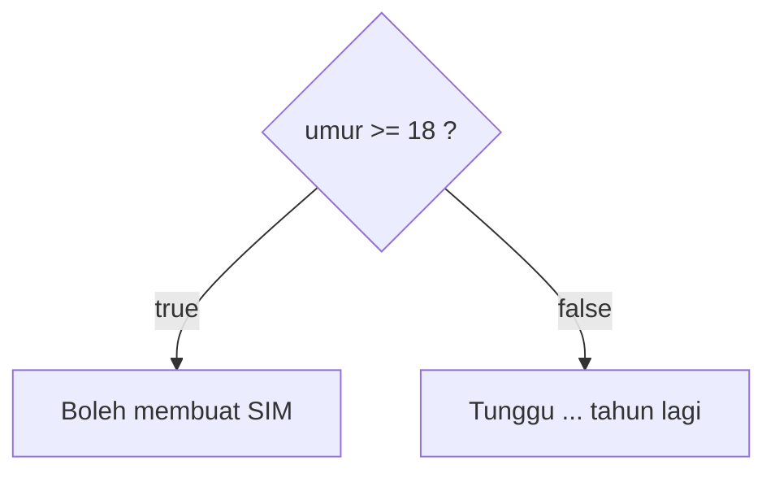

# 07 · Keputusan: `if / else`

## 🎯 Tujuan Belajar
- Membuat program yang bisa **mengambil keputusan**
- Memakai `if`, `else`, dan `else if`
- Memahami **block scope**: variabel di dalam `{ }`
- Memahami aturan TypeScript: variabel **wajib diisi** sebelum dipakai

---

## 🧠 Analogi: Persimpangan Jalan

```text
Apakah hujan?
   ├── YA    → bawa payung
   └── TIDAK → pakai kacamata hitam
```

Program juga bisa memilih jalan berdasarkan **kondisi** yang bernilai `true` atau `false`.

---

## 💻 `if / else`

```ts
const umur = 15;

if (umur >= 18) {
  console.log("Boleh membuat SIM 🚗");
} else {
  const tahunLagi = 18 - umur;
  console.log(`Belum boleh. Tunggu ${tahunLagi} tahun lagi ⏳`);
}
```

| Bagian | Arti |
| :--- | :--- |
| `if (kondisi)` | Jika kondisi `true`, jalankan blok pertama |
| `{ ... }` | **Blok kode**: kumpulan perintah |
| `else` | Jika kondisi `false`, jalankan blok ini (opsional) |



## 💻 `else if`: Lebih dari Dua Pilihan

```ts
const nilai = 78;

if (nilai >= 90) {
  console.log("A");
} else if (nilai >= 80) {
  console.log("B");
} else if (nilai >= 70) {
  console.log("C"); // ← yang ini dijalankan
} else {
  console.log("D");
}
```

Kondisi diperiksa **dari atas ke bawah**. Begitu ada yang `true`, sisanya **dilewati**.

> ⚠️ **Urutan penting!** Jika `nilai >= 70` ditulis paling atas, nilai 95 juga akan mendapat "C".

---

## 📦 Block Scope

Variabel yang dibuat **di dalam** `{ }` hanya hidup di dalam blok itu:

```ts
if (umur >= 18) {
  const pesan = "Selamat!";
}
console.log(pesan); // ❌ Cannot find name 'pesan'.
```

Solusinya, buat variabelnya **di luar** blok:

```ts
let pesan: string;
if (umur >= 18) {
  pesan = "Selamat!";
} else {
  pesan = "Coba lagi nanti";
}
console.log(pesan); // ✅
```

---

## 🔷 Versi TypeScript: Variabel Wajib Diisi di Semua Jalur

```ts
const umur: number = 15;
let status: string;

if (umur >= 18) {
  status = "dewasa";
}

console.log(status);
// ❌ Variable 'status' is used before being assigned.
```

TypeScript menyadari: *"Kalau umur di bawah 18, `status` tidak pernah diisi!"*
Di JavaScript biasa, hasilnya diam-diam `undefined`.

**Perbaikan**: tambahkan `else` agar **semua jalur** mengisi `status`.

---

## ⚠️ Kesalahan Umum
- Menulis `=` (assignment) di kondisi, padahal maksudnya membandingkan
- Urutan `else if` yang salah, misalnya kondisi paling umum ditulis paling atas
- Membuat variabel di dalam blok lalu memakainya di luar blok
- Lupa kurung kurawal `{ }`. Selalu tulis meskipun isinya hanya satu baris

---

## ✍️ Latihan

Kerjakan [`latihan.ts`](./latihan.ts), lalu cocokkan dengan [`solusi.ts`](./solusi.ts).

---

## 📌 Ringkasan
- `if (kondisi) { } else { }` memilih satu dari dua jalan
- `else if` untuk banyak pilihan. Diperiksa dari atas, dan hanya **satu** yang dijalankan
- Variabel di dalam `{ }` hanya hidup di blok itu (**block scope**)
- TypeScript memastikan variabel **sudah diisi** di semua jalur sebelum dipakai
