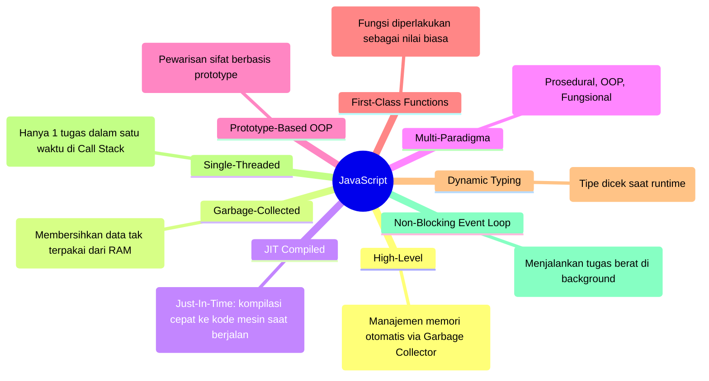
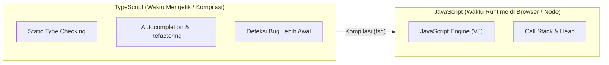

# 01 · Gambaran Besar JavaScript & TypeScript

## 🎯 Tujuan Belajar
- Memahami 9 karakteristik inti bahasa **JavaScript**
- Mengetahui apa itu **High-Level Language**, **Garbage Collection**, dan **JIT Compilation**
- Memahami konsep **Single-Threaded** dan **Non-Blocking I/O**
- Memahami posisi **TypeScript** sebagai *superset* dari JavaScript

---

## 🌐 9 Karakteristik Inti JavaScript

---

## 🔷 Di Mana Posisi TypeScript?

JavaScript dirancang dengan tipe dinamis (*dynamic typing*), artinya tipe data baru diperiksa saat program sedang berjalan di hadapan pengguna.

**TypeScript hadir sebagai lapisan pelindung (*Superset*)**:

TypeScript **tidak berjalan langsung** di mesin JavaScript. TypeScript diubah (*transpile*) menjadi JavaScript murni yang bersih.

---

## ✍️ Latihan

Buka [`latihan.ts`](./latihan.ts) dan cocokkan dengan [`solusi.ts`](./solusi.ts).

---

## 📌 Ringkasan
- JavaScript adalah bahasa *high-level*, *single-threaded*, dan *multi-paradigma* dengan manajemen memori otomatis.
- TypeScript menambahkan *static typing* dan pemeriksaan kode di waktu penulisan, yang kemudian dikompilasi menjadi JavaScript standar.
