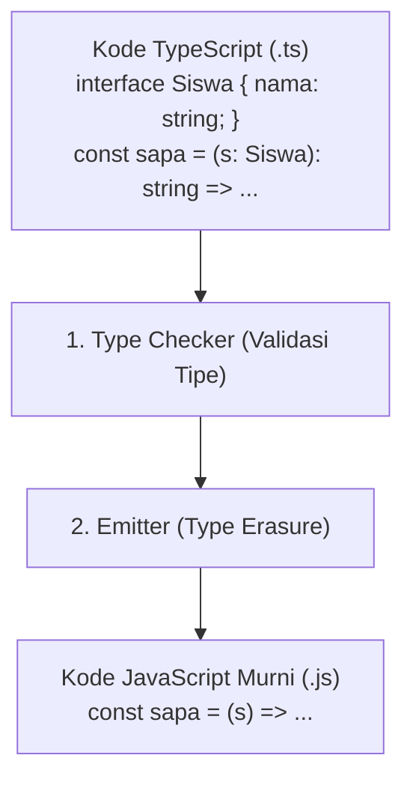

# 02 · Dari TypeScript ke JavaScript (Type Erasure)

## 🎯 Tujuan Belajar
- Memahami proses kompilasi kode dari TypeScript (`.ts`) menjadi JavaScript (`.js`)
- Memahami konsep **Type Erasure** (penghapusan tipe data saat runtime)
- Melihat hasil bedah file di dalam folder `dist/`
- Mengetahui mengapa TypeScript **tidak membebani performa** aplikasi saat dijalankan

---

## 🧠 Analogi: Gambar Cetak Biru vs Bangunan Nyata

- **TypeScript = Cetak Biru Arsitek**: Penuh dengan garis ukur, tanda panah toleransi beban, dan catatan keamanan.
- **JavaScript = Bangunan Jadi**: Garis-garis ukur arsitek dihapus saat gedung selesai dibangun. Pengunjung gedung tidak melihat coretan arsitek, tetapi gedungnya berdiri kokoh karena sudah diverifikasi sebelumnya.

---

## 🔍 Apa itu Type Erasure?

Ketika perintah `tsc` dijalankan, TypeScript compiler melakukan 2 tugas:
1. **Memeriksa tipe**: Memastikan tidak ada kesalahan logika tipe.
2. **Menghapus seluruh anotasi tipe (Type Erasure)**: Menghapus `interface`, `type`, dan anotasi `: string`, `: number` sehingga yang tersisa adalah kode JavaScript murni.



---

## 🔬 Perbandingan Sebelum & Sesudah Kompilasi

### Kode TypeScript Asli:
```ts
interface Produk {
  id: number;
  nama: string;
  harga: number;
}

function hitungDiskon(barang: Produk, diskon: number): number {
  return barang.harga - (barang.harga * diskon) / 100;
}
```

### Hasil JavaScript Kompilasi:
```js
function hitungDiskon(barang, diskon) {
  return barang.harga - (barang.harga * diskon) / 100;
}
```

> 💡 Perhatikan: `interface Produk` dan semua anotasi tipe **lenyap tanpa jejak**. Yang tersisa hanyalah logika murni JavaScript yang sangat ringan dan cepat!

---

## ✍️ Latihan

Buka [`latihan.ts`](./latihan.ts) dan cocokkan dengan [`solusi.ts`](./solusi.ts).

---

## 📌 Ringkasan
- Kompilasi TypeScript menghapus seluruh tipe data (**Type Erasure**).
- Tipe data TypeScript **tidak ada saat runtime** dan tidak menggunakan memori di browser/server.
- TypeScript memberi keamanan 100% saat pengembangan dengan biaya performa 0% saat produksi.
