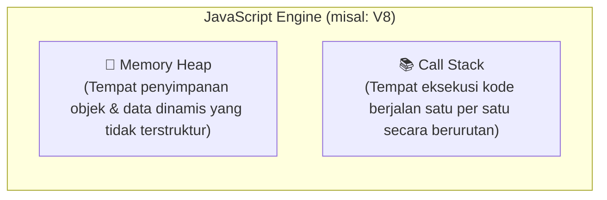
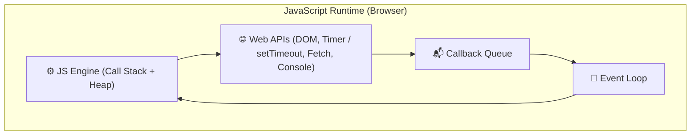

# 03 · JavaScript Engine & Runtime

## 🎯 Tujuan Belajar
- Memahami apa itu **JavaScript Engine** (seperti Google V8)
- Membedakan antara **Call Stack** (tempat eksekusi) dan **Memory Heap** (tempat simpan objek)
- Memahami perbedaan **Engine** vs **Runtime Environment** (Browser vs Node.js)
- Mengenal gambaran umum **Web APIs** dan **Event Loop**

---

## ⚙️ Apa itu JavaScript Engine?

JavaScript Engine adalah program komputer yang membaca dan mengeksekusi kode JavaScript.
- **Google V8**: Dipakai di Google Chrome, Microsoft Edge, dan Node.js / Deno.
- **SpiderMonkey**: Dipakai di Mozilla Firefox.
- **JavaScriptCore**: Dipakai di Apple Safari.

---

## 🏗️ 2 Komponen Inti di dalam Engine

1. **Memory Heap**: Kolam memori besar yang tidak terstruktur tempat semua objek (*object*), array, dan fungsi dialokasikan.
2. **Call Stack**: Tumpukan tempat baris kode dan fungsi dijalankan secara berurutan (*Last In, First Out*).

---

## 🌐 Engine vs Runtime Environment

Sebuah Engine saja **belum cukup** untuk menjalankan website nyata. Engine harus dibungkus oleh **Runtime Environment**:

- **Di Browser Runtime**: Dilengkapi dengan **Web APIs** (akses elemen DOM, `fetch` HTTP, `setTimeout`).
- **Di Node.js Runtime**: Web API digantikan oleh **C++ Bindings & Node APIs** (akses file sistem `fs`, server jaringan `http`, kriptografi).

---

## ✍️ Latihan

Buka [`latihan.ts`](./latihan.ts) dan cocokkan dengan [`solusi.ts`](./solusi.ts).

---

## 📌 Ringkasan
- JavaScript Engine terdiri dari **Memory Heap** (alokasi memori objek) dan **Call Stack** (eksekusi kode).
- Runtime adalah "wadah besar" yang menggabungkan Engine dengan API luar (seperti DOM di browser atau sistem file di Node.js).
- Event Loop menghubungkan tugas asinkron kembali ke Call Stack saat stack kosong.
