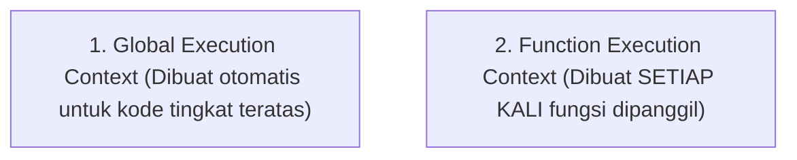
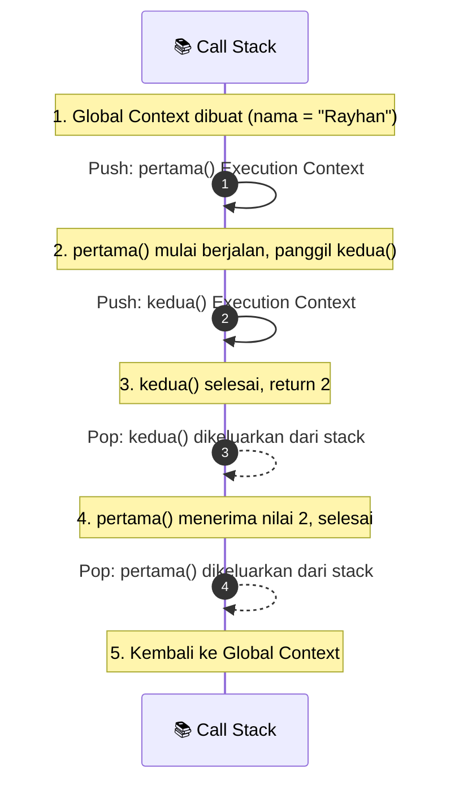

# 04 · Execution Context & Call Stack

## 🎯 Tujuan Belajar
- Memahami apa itu **Execution Context** (lingkungan eksekusi kode)
- Membedakan **Global Execution Context** dan **Function Execution Context**
- Mengetahui 3 komponen di dalam Execution Context: *Variable Environment*, *Scope Chain*, dan keyword *`this`*
- Memvisualisasikan pergerakan tumpukan fungsi di dalam **Call Stack** (*Push & Pop*)

---

## 📦 Apa itu Execution Context?

Execution Context adalah sebuah "kotak/wadah" tempat sepotong kode JavaScript dievaluasi dan dijalankan.



Di dalam setiap Execution Context terdapat 3 hal penting:
1. **Variable Environment**: Daftar variabel (`let`, `const`, `var`), deklarasi fungsi, dan objek `arguments`.
2. **Scope Chain**: Rantai referensi ke variabel-variabel di luar fungsi saat ini.
3. **Keyword `this`**: Referensi penunjuk konteks pemanggil (kecuali pada arrow function).

---

## 📚 Call Stack: Mekanisme Tumpukan (LIFO)

Call Stack bekerja dengan prinsip **LIFO (Last In, First Out)** — fungsi yang dipanggil paling akhir akan diselesaikan dan dikeluarkan paling pertama.

### Contoh Alur:
```ts
const nama = "Rayhan";

function pertama(): void {
  const a = 1;
  const b = kedua();
  console.log(a + b);
}

function kedua(): number {
  const c = 2;
  return c;
}

pertama();
```



---

## ✍️ Latihan

Buka [`latihan.ts`](./latihan.ts) dan cocokkan dengan [`solusi.ts`](./solusi.ts).

---

## 📌 Ringkasan
- Execution Context adalah lingkungan kerja tempat kode dieksekusi.
- Global Context dibuat sekali untuk kode terluar; Function Context dibuat setiap kali fungsi dipanggil.
- Call Stack mengatur urutan eksekusi menggunakan prinsip *Last In First Out*.
