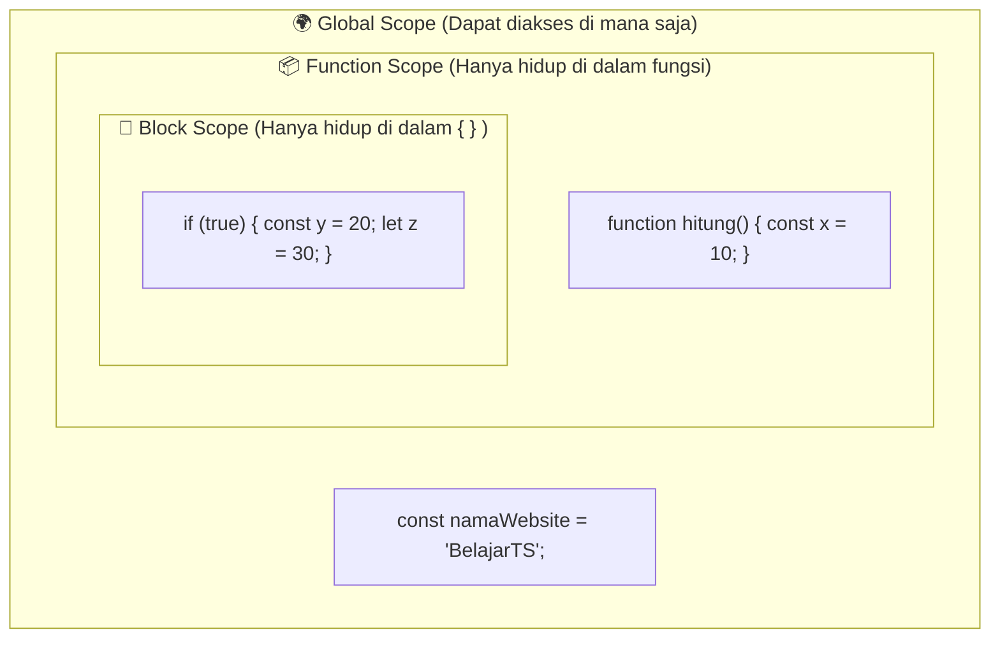
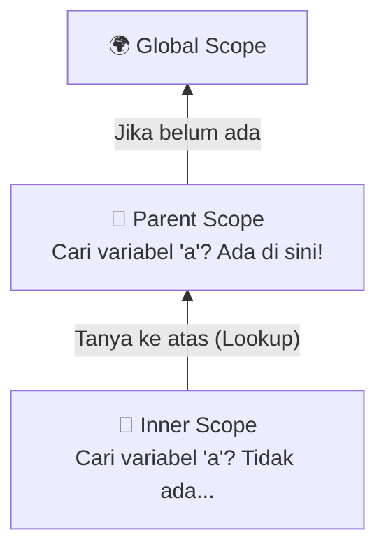

# 05 · Scope & Scope Chain (Cakupan Variabel)

## 🎯 Tujuan Belajar
- Memahami konsep **Lexical Scoping** (ruang lingkup yang ditentukan dari tempat kode ditulis secara fisik)
- Membedakan 3 jenis Scope: **Global Scope**, **Function Scope**, dan **Block Scope**
- Memahami perbedaan cakupan antara `let`/`const` (*Block Scoped*) dengan `var` (*Function Scoped*)
- Memahami cara kerja **Scope Chain & Variable Lookup** (pencarian variabel ke scope atasnya)

---

## 🔍 3 Jenis Scope di JavaScript/TypeScript

1. **Global Scope**: Variabel yang ditulis di luar fungsi/blok apa pun. Bisa dibaca oleh seluruh bagian program.
2. **Function Scope**: Variabel yang dibuat di dalam fungsi. Hanya bisa diakses di dalam fungsi tersebut.
3. **Block Scope (ES6)**: Variabel `let` dan `const` yang dibuat di dalam kurung kurawal `{ ... }` (seperti `if`, `for`, `switch`).

---

## 🔗 Scope Chain: Aturan Pencarian Variabel (Variable Lookup)

Jika sebuah fungsi membutuhkan variabel:
1. JS Engine memeriksa **scope dirinya sendiri**.
2. Jika tidak ada, ia melihat **satu tingkat ke atas (parent scope)**.
3. Ini berlanjut sampai ke **Global Scope**.
4. ⚠️ **Arah pencarian HANYA KE ATAS**, tidak pernah bisa mengintip ke dalam scope anak/bawah!

---

## ✍️ Latihan

Buka [`latihan.ts`](./latihan.ts) dan cocokkan dengan [`solusi.ts`](./solusi.ts).

---

## 📌 Ringkasan
- JavaScript menggunakan **Lexical Scoping** (posisi penulisan kode menentukan akses).
- `let` dan `const` bersifat **Block Scoped** (terkunci di dalam `{ }`).
- Scope Chain mencari variabel dari dalam ke luar (**Lookup ke atas**), bukan sebaliknya.
