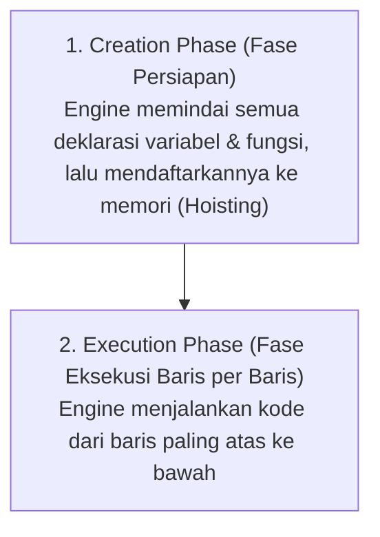

# 06 · Hoisting & TDZ (Temporal Dead Zone)

## 🎯 Tujuan Belajar
- Memahami konsep **Hoisting** (pengangkatan deklarasi variabel/fungsi pada fase persiapan memori)
- Mengetahui mengapa variabel `var` menghasilkan nilai `undefined` saat dipanggil sebelum dideklarasikan
- Memahami apa itu **TDZ (Temporal Dead Zone)** pada variabel `let` dan `const`
- Melihat bagaimana TypeScript mendeteksi kesalahan *"used before declaration"* sejak awal

---

## 🏗️ 2 Fase Eksekusi Kode JavaScript

Saat JavaScript Engine mengevaluasi sebuah file, ada 2 fase yang terjadi:



---

## 📊 Perilaku Hoisting Berdasarkan Jenis Deklarasi

| Deklarasi | Apakah Terkena Hoisting? | Nilai Awal Saat Hoisting | Bisa Dipanggil Sebelum Barisnya? |
| :--- | :---: | :---: | :---: |
| **Function Declaration** | ✅ Ya | Fungsi aslinya | ✅ **Bisa** |
| **`var`** | ✅ Ya | `undefined` | ⚠️ Menghasilkan `undefined` |
| **`let` / `const`** | ✅ Ya | `<uninitialized>` (di dalam **TDZ**) | ❌ **Error: TDZ** |
| **Function Expression (`const`)** | ✅ Ya | Tergantung `const`/`let` (di dalam TDZ) | ❌ **Error: TDZ** |

---

## ⏳ Apa itu TDZ (Temporal Dead Zone)?

TDZ adalah "zona mati" antara **awal dimulainya suatu scope** sampai ke **baris tempat variabel `let`/`const` dideklarasikan**.

```ts
// --- Awal Scope ---
// ⚠️ WILAYAH TDZ untuk variabel 'umur' dimulai di sini!
console.log(umur); // ❌ ReferenceError / TS Error: Digunakan sebelum deklarasi!
// ⚠️ WILAYAH TDZ masih berlangsung...

let umur = 25; // 🎉 TDZ BERAKHIR DI SINI! Variabel diinisialisasi
console.log(umur); // ✅ 25 (Aman)
```

---

## 🔷 Versi TypeScript: Proteksi Penggunaan Sebelum Deklarasi

Di TypeScript, kamu tidak perlu menunggu runtime error. TypeScript langsung memberi tanda merah bergelombang:

```ts
console.log(namaDepan);
// ❌ Block-scoped variable 'namaDepan' used before its declaration.
const namaDepan = "Rayhan";
```

---

## ✍️ Latihan

Buka [`latihan.ts`](./latihan.ts) dan cocokkan dengan [`solusi.ts`](./solusi.ts).

---

## 📌 Ringkasan
- Hoisting mendaftarkan fungsi dan variabel ke memori pada fase persiapan (*Creation Phase*).
- Hanya **Function Declaration** yang aman dipanggil sebelum baris deklarasinya.
- `let` dan `const` terkunci di dalam **TDZ** sampai baris deklarasinya tercapai.
- TypeScript secara otomatis melarang penggunaan variabel di dalam TDZ.
