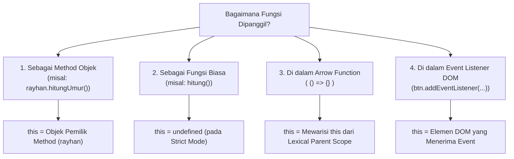

# 07 · Keyword `this` di Balik Layar

## 🎯 Tujuan Belajar
- Memahami apa sebenarnya kata kunci **`this`** di JavaScript
- Memahami aturan penentuan `this` berdasarkan **bagaimana fungsi dipanggil** (*Call-Site Binding*)
- Membedakan 4 skenario penentu nilai `this`:
  1. **Method Objek** (`obj.method()`)
  2. **Pemanggilan Fungsi Biasa** (`fungsi()`)
  3. **Arrow Function** (`() => {}`)
  4. **Event Listener DOM**
- Memberikan anotasi tipe parameter `this` secara eksplisit di TypeScript

---

## 🧭 Apa itu `this`?

`this` adalah variabel khusus yang dibuat otomatis untuk setiap *Function Execution Context*.
Nilai `this` **bersifat dinamis** — nilainya bergantung pada **SIAPA yang memanggil fungsinya pada saat dijalankan** (*runtime*), bukan di mana fungsinya ditulis.

---

## 📋 4 Aturan Nilai `this`



---

## 🔍 Contoh 4 Skenario

### 1. Method Objek:
```ts
const siswa = {
  nama: "Rayhan",
  tahunLahir: 2001,
  hitungUmur() {
    console.log(this); // this = objek siswa
    return 2026 - this.tahunLahir;
  }
};
siswa.hitungUmur();
```

### 2. Fungsi Biasa (Strict Mode):
```ts
function sapaBiasa() {
  console.log(this); // undefined!
}
sapaBiasa();
```

### 3. Meminjam Method (Method Borrowing):
Karena `this` dinamis, satu fungsi method bisa dipinjamkan ke objek lain:
```ts
const budi = {
  nama: "Budi",
  tahunLahir: 1995,
  hitungUmur: siswa.hitungUmur // Meminjam method hitungUmur dari siswa
};

budi.hitungUmur(); // this sekarang merujuk ke BUDI, bukan Rayhan!
```

---

## ✍️ Latihan

Buka [`latihan.ts`](./latihan.ts) dan cocokkan dengan [`solusi.ts`](./solusi.ts).

---

## 📌 Ringkasan
- `this` tidak bersifat statis, melainkan ditentukan oleh **siapa yang memanggil fungsi**.
- Pada pemanggilan method `obj.method()`, `this` adalah `obj`.
- Pada fungsi biasa di bawah mode strict, `this` bernilai `undefined`.
- Arrow function tidak memiliki `this` sendiri (mewarisi dari scope luar).
