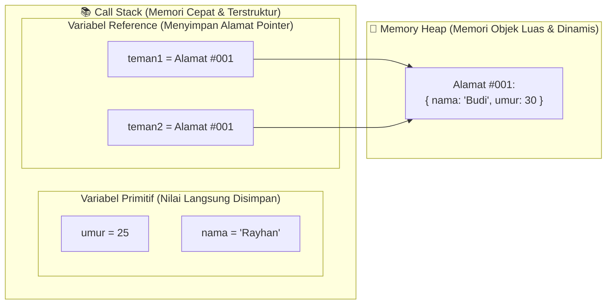

# 09 · Primitif vs Reference (Memori Stack vs Heap)

## 🎯 Tujuan Belajar
- Memahami perbedaan fundamental penyimpanan memori antara **Tipe Primitif** dan **Tipe Reference (Objek)**
- Mengetahui mengapa tipe primitif disimpan di **Call Stack**, sedangkan objek disimpan di **Memory Heap**
- Memahami mengapa menyalin objek (`const b = a`) **hanya menyalin alamat memorinya (pointer)**, bukan membuat objek baru
- Memahami mengapa objek `const` tetap bisa diubah isinya

---

## 🧠 Analogi: Kertas Fotokopi vs Tautan Google Docs

- **Tipe Primitif (Fotokopi Dokumen)**: Jika kamu memfotokopi catatan dan memberikan salinannya ke teman, lalu temanmu mencoret salinannya, catatan aslimu **tidak akan ikut tercoret**.
- **Tipe Reference / Objek (Tautan Link Google Docs)**: Jika kamu membagikan *link URL* Google Docs ke teman, kamu dan temanmu memegang **link yang sama**. Jika temanmu mengedit isi dokumen via link tersebut, dokumen yang kamu lihat **ikut berubah**!

---

## 🏗️ Model Memori di Balik Layar



---

## 🔬 Bukti Perilaku Kode

### 1. Perilaku Tipe Primitif:
```ts
let umur1 = 25;
let umur2 = umur1; // Nilai 25 disalin secara mandiri
umur2 = 30;

console.log(umur1); // 25 (Aslinya TIDAK berubah!)
console.log(umur2); // 30
```

### 2. Perilaku Tipe Objek (Reference):
```ts
const siswa1 = { nama: "Budi", umur: 25 };
const siswa2 = siswa1; // Menyalin ALAMAT MEMORI yang sama (bukan objek baru!)

siswa2.umur = 30; // Mengubah data di alamat memori yang sama

console.log(siswa1.umur); // 30 (Ikut berubah karena merujuk ke memori yang sama!)
console.log(siswa2.umur); // 30
```

> 💡 **Mengapa `const siswa1` boleh diubah isinya?**
> Karena `const` hanya mengunci **alamat memori di Call Stack** agar tidak diganti dengan objek lain. Data di dalam **Memory Heap** tetap boleh dimodifikasi.

---

## ✍️ Latihan

Buka [`latihan.ts`](./latihan.ts) dan cocokkan dengan [`solusi.ts`](./solusi.ts).

---

## 📌 Ringkasan
- Data primitif disimpan langsung di **Call Stack** (penyalinan membuat nilai baru yang independen).
- Objek/Array disimpan di **Memory Heap**; variabel di stack hanya menyimpan **alamat referensi (pointer)**.
- Menyalin variabel objek hanya menduplikasi pointer, sehingga perubahan di salinan akan memengaruhi objek asli.
