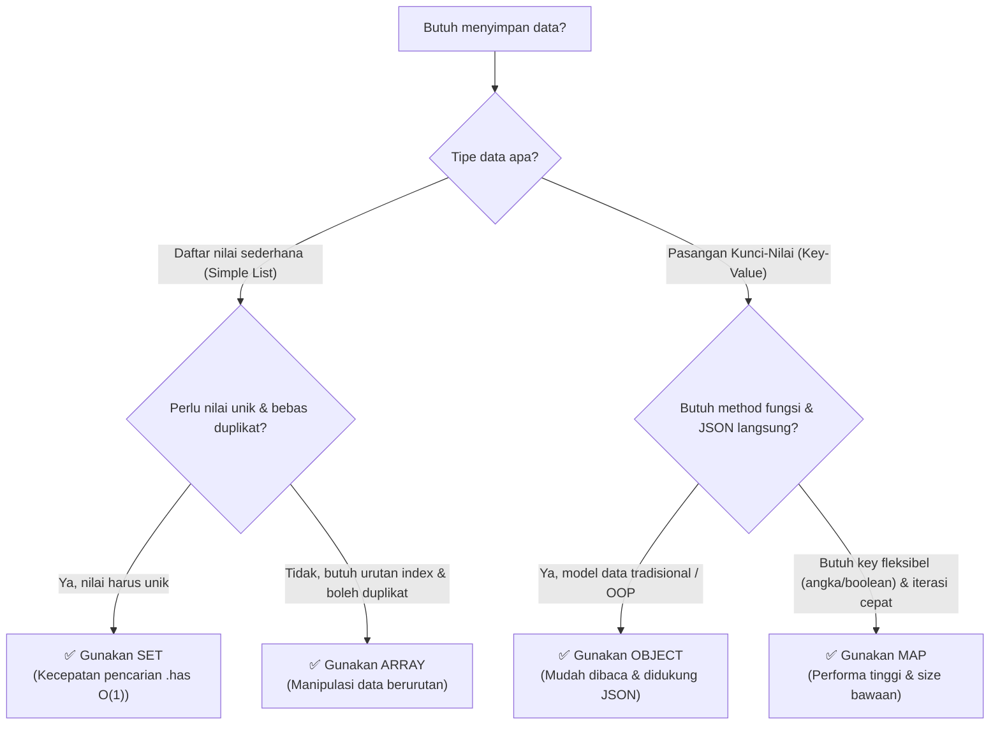

# 15 · Memilih Struktur Data yang Tepat

## 🎯 Tujuan Belajar
- Memahami perbandingan komprehensif antara **4 struktur data utama** JavaScript/TypeScript:
  - **Array** vs **Set** (Daftar Nilai Tunggal)
  - **Object** vs **Map** (Pasangan Key-Value)
- Menguasai **Tabel Keputusan** untuk memilih struktur data terbaik berdasarkan studi kasus nyata.
- Mengetahui kapan performa pencarian `Set`/`Map` jauh lebih unggul daripada `Array`/`Object`.

---

## 🗺️ Diagram Pilihan Struktur Data



---

## 📊 Tabel Perbandingan Lengkap

### 1. Array vs Set (Daftar Nilai Tunggal)

| Fitur | `Array` | `Set` |
| :--- | :--- | :--- |
| **Urutan Elemen** | Berurutan berdasarkan indeks (`[0]`, `[1]`) | Tidak berurutan (hanya urutan penyisipan) |
| **Duplikat** | Diizinkan (boleh ada nilai kembar) | **Dilarang** (otomatis disaring unik) |
| **Akses Indeks** | `arr[0]` (sangat mudah) | Tidak bisa `set[0]` |
| **Kecepatan Cek Data** | Lambat jika array besar (`arr.includes()` $O(n)$) | **Sangat Cepat** (`set.has()` $O(1)$) |
| **Kapan Dipakai?** | Saat kamu butuh urutan pasti, data boleh duplikat, dan sering memanipulasi elemen (`map`, `filter`). | Saat kamu ingin menghapus duplikat atau sering memeriksa keberadaan elemen. |

---

### 2. Object vs Map (Pasangan Key-Value)

| Fitur | `Object` | `Map` |
| :--- | :--- | :--- |
| **Tipe Kunci (*Key*)** | Hanya `string` dan `Symbol` | **Tipe apa saja** (angka, boolean, array, object) |
| **Ukuran Data** | Manual: `Object.keys(obj).length` | Otomatis & Cepat: `map.size` |
| **Iterasi Langsung** | Harus lewat `Object.entries(obj)` | Bisa langsung di-`for...of` |
| **JSON Support** | Asli bawaan (`JSON.stringify`) | Perlu konversi manual |
| **Method / Fungsi** | Mudah mendefinisikan method `this` | Didesain murni sebagai kamus data |
| **Kapan Dipakai?** | Struktur data tetap (DTO, model pengguna, konfigurasi, entity dengan method). | Kamus data dinamis yang sering ditambah/dihapus, key non-string, atau butuh performa tinggi. |

---

## ▶️ Cara Menjalankan

```bash
npm run materi -- materi/04-data-structures-operators-strings/15-memilih-struktur-data/contoh.ts
```

---

## ✍️ Latihan

Buka [`latihan.ts`](./latihan.ts) lalu jawab studi kasus penentuan struktur data. Cocokkan dengan [`solusi.ts`](./solusi.ts).

---

## 📌 Ringkasan
- Butuh daftar terurut & manipulasi elemen? → **Array**.
- Butuh data unik tanpa duplikat & pencarian instan? → **Set**.
- Butuh model data tetap dengan method & serialisasi JSON? → **Object**.
- Butuh key fleksibel (angka/boolean) & sering update dinamis? → **Map**.
