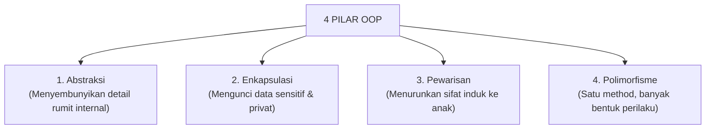

# 01 · Apa itu Object-Oriented Programming (OOP)?

## 🎯 Tujuan Belajar
- Memahami konsep dasar **Pemrograman Berorientasi Objek (OOP)** sebagai paradigma pemodelan kode berbasis objek dunia nyata.
- Membedakan antara **Class (Cetakan / Blueprint)** vs **Instance (Objek Nyata Hasil Cetakan)**.
- Menguasai **4 Pilar Utama OOP**:
  1. **Abstraksi (*Abstraction*)**
  2. **Enkapsulasi (*Encapsulation*)**
  3. **Pewarisan (*Inheritance*)**
  4. **Polimorfisme (*Polymorphism*)**

---

## 🧠 Analogi: Denah Rumah vs Rumah Fisik

- **Class (Denah / Blueprint)**: Gambar sketsa arsitektur rumah di atas kertas. Di kertas itu tertulis ada 3 kamar tidur, 1 garasi, dan 1 pintu utama. Kamu tidak bisa tinggal di dalam kertas denah.
- **Instance (Rumah Fisik)**: Rumah nyata yang dibangun semen dan batanya berdasarkan denah tersebut di Jl. Merdeka No. 10. Dari 1 denah yang sama, kamu bisa membangun 10 rumah fisik berbeda di berbagai kota!

---

## 🏛️ 4 Pilar Utama OOP



### 1. Abstraksi (*Abstraction*)
Menyembunyikan detail teknis yang tidak perlu diketahui oleh pengguna.
- *Contoh*: Pengemudi mobil hanya perlu menginjak pedal gas untuk mempercepat laju mobil, tanpa perlu tahu bagaimana busi memercikkan api atau piston bergerak di dalam mesin.

### 2. Enkapsulasi (*Encapsulation*)
Menjaga properti dan method tertentu agar bersifat privat (*private*) dan hanya bisa diubah lewat pintu yang aman (*setter/method resmi*).
- *Contoh*: Saldo rekening bank tidak boleh diubah sembarang angka oleh orang luar; saldo hanya bisa bertambah lewat method `setor()` yang terverifikasi.

### 3. Pewarisan (*Inheritance*)
Membuat class baru yang mewarisi sifat dan kemampuan dari class yang sudah ada (*Parent Class -> Child Class*).
- *Contoh*: Class `MobilListrik` mewarisi properti `merk` dan method `jalan()` dari class `Mobil`, tetapi memiliki kemampuan tambahan `isiDayaBaterai()`.

### 4. Polimorfisme (*Polymorphism*)
Berasal dari bahasa Yunani yang berarti *"banyak bentuk"*. Class turunan dapat mengubah atau menyesuaikan implementasi method yang diwarisinya dari class induk.
- *Contoh*: Class `Burung` dan `Ikan` sama-sama mewarisi method `bergerak()`, tetapi Burung bergerak dengan *terbang*, sedangkan Ikan bergerak dengan *berenang*.

---

## ▶️ Cara Menjalankan

```bash
npm run materi -- materi/06-oop-typescript/01-apa-itu-oop/contoh.ts
```

---

## ✍️ Latihan

Buka [`latihan.ts`](./latihan.ts) lalu jawab pertanyaan pemahaman konsep 4 pilar. Cocokkan dengan [`solusi.ts`](./solusi.ts).

---

## 📌 Ringkasan
- OOP memodelkan kode ke dalam objek-objek mandiri yang memiliki **State (Data/Property)** dan **Behavior (Perilaku/Method)**.
- 4 Pilar: Abstraksi, Enkapsulasi, Pewarisan, Polimorfisme.
