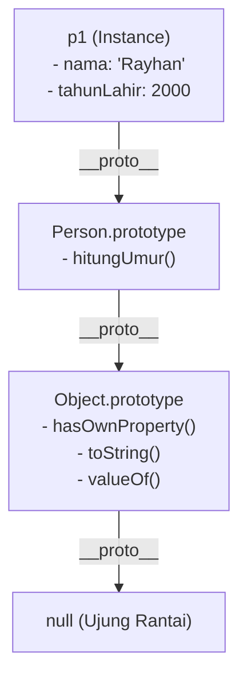

# 03 · Di Balik Layar: Prototype & Prototype Chain

## 🎯 Tujuan Belajar
- Memahami konsep **Prototypal Inheritance**: bagaimana objek-objek di JavaScript/TypeScript mewarisi method dan properti melalui rantai prototype.
- Membedakan dengan jelas antara `Constructor.prototype` vs `instance.__proto__`.
- Memahami **Prototype Chain (Rantai Prototype)**: proses pencarian method dari instance ke atas hingga `Object.prototype` dan `null`.
- Menggunakan method `.hasOwnProperty()` untuk mengecek kepemilikan properti asli (*own property*).

---

## 🧠 Analogi: Pohon Silsilah Keluarga

- Kamu (Instance) membutuhkan keahlian *"Memasak"*.
- Kamu mengecek dirimu sendiri: tidak punya resepnya.
- Kamu bertanya ke **Ayahmu (`Person.prototype`)**: Ayahmu punya resep tersebut dan meminjamkannya kepadamu!
- Jika Ayahmu juga tidak punya, kalian bersama-sama bertanya ke **Kakek Buyut (`Object.prototype`)**.
- Jika Kakek Buyut juga tidak punya, pencarian berakhir di `null` (Error: method tidak ditemukan).

---

## 🔗 Diagram Prototype Chain



---

## 📘 Konsep Dasar

### 1. Prototype Bukan Milik Constructor Itu Sendiri

Perhatikan konsep penting ini:
- `Person.prototype` **BUKAN** prototype dari fungsi `Person`.
- `Person.prototype` adalah objek prototype yang akan **dijadikan cetakan warisan bagi SEMUA objek yang dibuat lewat `new Person()`**.

```ts
function User(this: any, nama: string) {
  this.nama = nama;
}

User.prototype.sapa = function () {
  console.log(`Halo, saya ${this.nama}`);
};

const u1 = new (User as any)("Rayhan");

// Memeriksa hubungan prototype
console.log(u1.__proto__ === User.prototype); // true
console.log(User.prototype.isPrototypeOf(u1)); // true
```

---

### 2. Own Properties vs Inherited Properties

```ts
// Properti langsung di objek
console.log(u1.hasOwnProperty("nama")); // true (properti milik sendiri)

// Properti/Method yang diwarisi dari prototype
console.log(u1.hasOwnProperty("sapa")); // false (milik User.prototype)
```

---

## ▶️ Cara Menjalankan

```bash
npm run materi -- materi/06-oop-typescript/03-prototype-dan-prototype-chain/contoh.ts
```

---

## 📌 Ringkasan
- Setiap objek JavaScript memiliki prototype tersembunyi (`__proto__`).
- Ketika sebuah method dipanggil, JavaScript mencarinya di objek itu sendiri, lalu naik ke Prototype-nya, hingga ke `Object.prototype`.
- Inilah mekanisme sebenarnya di balik keyword `class` yang kita gunakan sehari-hari.
