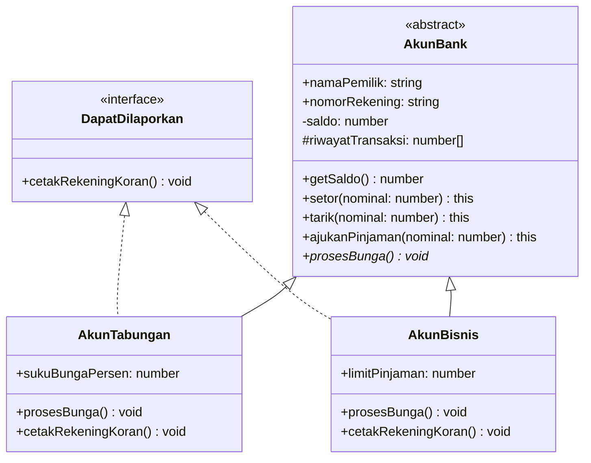

# 15 · Proyek Akhir: Sistem Manajemen Perbankan (Bankist OOP)

Selamat datang di **Proyek Akhir Modul 06**! 🏆

Di proyek ini, kamu akan membangun arsitektur sistem perbankan nyata menggunakan semua prinsip OOP yang telah dipelajari: **Class**, **Interface**, **Inheritance**, **Enkapsulasi**, **Getter/Setter**, **Method Chaining**, dan **Polimorfisme**.

---

## 🏛️ Desain Arsitektur Sistem



---

## 📋 Spesifikasi Kebutuhan Proyek

1. **Interface `DapatDilaporkan`**:
   - Method `cetakRekeningKoran(): void`.

2. **Abstract Class `AkunBank`**:
   - Properti `public readonly nomorRekening: string`.
   - Properti `public namaPemilik: string`.
   - Properti `private _saldo: number`.
   - Properti `protected riwayatMutasi: number[] = []`.
   - Getter `get saldo(): number`.
   - Method `setor(nominal: number): this` (menambah saldo, mencatat mutasi positif, chaining `return this`).
   - Method `tarik(nominal: number): this` (memvalidasi saldo cukup, mencatat mutasi negatif, chaining `return this`).
   - Method `ajukanPinjaman(nominal: number): this` (mengecek riwayat deposit sebelum menyetujui pinjaman, chaining `return this`).
   - Abstract method `abstract prosesBunga(): void`.

3. **Class `AkunTabungan` (Turunan `AkunBank` & Implements `DapatDilaporkan`)**:
   - Constructor menerima bunga bulanan (misal 2%).
   - Implementasikan `prosesBunga()` (menambahkan bunga ke saldo).
   - Implementasikan `cetakRekeningKoran()` (menampilkan ringkasan mutasi kredit/debit).

4. **Class `AkunBisnis` (Turunan `AkunBank` & Implements `DapatDilaporkan`)**:
   - Memiliki limit pinjaman lebih besar dan penanganan biaya admin transaksi.

---

## ▶️ Cara Menjalankan

```bash
npm run materi -- materi/06-oop-typescript/15-proyek-sistem-bank/latihan.ts
```

Cocokkan implementasi sistem perbankanmu dengan [`solusi.ts`](./solusi.ts)!
